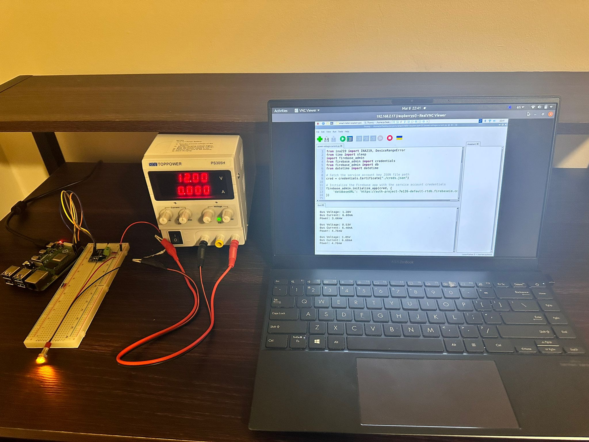

# Smart Metering Testbed  

A scalable and reliable system for real-time energy metering, leveraging modern C++ design patterns and embedded system expertise. This testbed demonstrates precise energy measurements and efficient data transmission to the cloud.  

---

## Features  
- **Real-time Energy Metering**: Accurate voltage, current, and wattage measurements using the INA219 chip.  
- **Embedded System Programming**:  
  - Programmed Raspberry Pi 4B (ARM A72) for precise data acquisition.  
  - Interfaced INA219 with the Raspberry Pi via the I2C protocol.  
- **Data Transmission**: Periodic data updates (every 5 seconds) to Google Cloud (Firebase).  
- **High Performance**:  
  - Leveraged **C/C++** for low-level device communication.  
  - Employed multithreading for efficient data collection and transmission.  
- **Robust Design**: Optimized for varying environmental conditions.  

---

## System Overview  

### Hardware Components  
1. **INA219**: Measures voltage drop, calculates current using Ohm’s law, and computes wattage.  
2. **Raspberry Pi 4B (ARM A72)**: Interfaces with the INA219 via I2C for data collection and transmission.  

### Principle of Operation  
1. The INA219 measures the voltage drop across a shunt resistor.  
2. Uses Ohm’s Law to compute current:  
   \[
   I = \frac{V}{R}
   \]  
3. Calculates wattage:  
   \[
   P = V \times I
   \]  
4. Raspberry Pi collects these values and transmits them to Firebase every 5 seconds.  

---

## Requirements  

### Hardware  
- Raspberry Pi 4B  
- INA219 Sensor Module  
- Shunt Resistor  
- Power Supply  

### Software  
- **OS**: Raspbian  
- **Programming Languages**: C/C++  
- **Libraries**: WiringPi for I2C communication  
- Google Firebase for cloud storage  

---

## Setup Instructions  

1. **Hardware Connections**:  
   - Connect the INA219 sensor to the Raspberry Pi via the I2C interface.  
   - Ensure proper shunt resistor placement for accurate readings.  

2. **Software Installation**:  
   - Install WiringPi library:  
     ```bash
     sudo apt-get install wiringpi
     ```  
   - Clone the repository:  
     ```bash
     git clone https://github.com/yourusername/smart-metering-testbed.git
     cd smart-metering-testbed
     ```  

3. **Build and Run**:  
   - Compile the program:  
     ```bash
     g++ -o metering_testbed main.cpp -lwiringPi -pthread
     ```  
   - Execute the program:  
     ```bash
     ./metering_testbed
     ```  

4. **Monitor Data**:  
   - Log in to your Firebase console to view real-time updates.  

---

## File Structure  
- `/src`: Source code for data acquisition and transmission.  
- `/docs`: Hardware schematics and project documentation.  

---

## Future Enhancements  
- Add support for multiple sensors for monitoring different circuits.  
- Implement predictive analytics for energy consumption.  
- Optimize data transmission to reduce network usage.  

---

## License  
This project is licensed under the MIT License. See the `LICENSE` file for details.  

---


